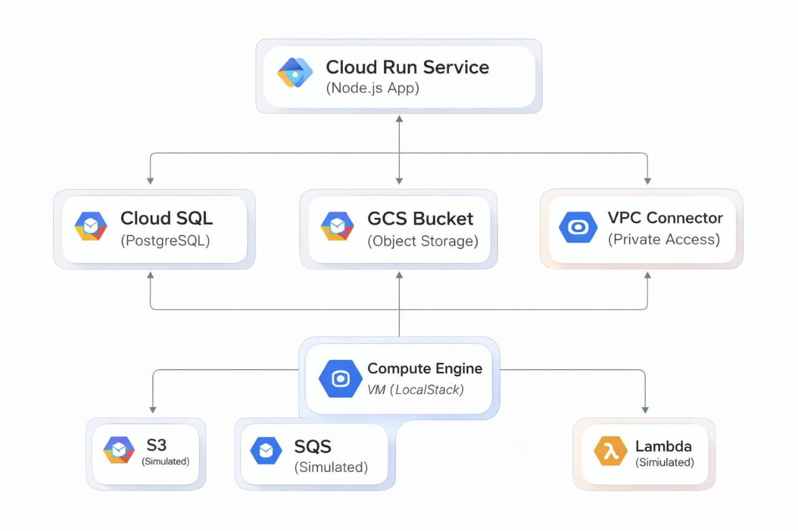

# Hybrid Cloud Architecture Project

## Overview

This project implements a Hybrid Cloud Architecture integrating:

- Google Cloud Platform (GCP)
- AWS services simulated using LocalStack
- Infrastructure as Code using Terraform
- Containerized microservices using Docker
- Monitoring using Google Cloud Monitoring

The system demonstrates real-world hybrid cloud communication between GCP services and AWS services.

---

##  Hybrid Cloud Architecture

This project demonstrates a hybrid cloud architecture integrating Google Cloud Platform (GCP) with simulated AWS services using LocalStack.



### Components Overview

- **Cloud Run (Node.js App)** – Main application service
- **Cloud SQL (PostgreSQL)** – Managed relational database
- **Google Cloud Storage (GCS)** – Object storage
- **VPC Connector** – Enables private communication
- **Compute Engine VM (LocalStack)** – Simulates AWS environment
- **S3 (Simulated)** – Object storage
- **SQS (Simulated)** – Messaging queue
- **Lambda (Simulated)** – Serverless function

---

# Tech Stack

- Google Cloud Run
- Google Cloud SQL (PostgreSQL)
- Google Cloud Storage
- Google VPC + VPC Connector
- LocalStack (S3, SQS, Lambda)
- Terraform
- Docker
- Node.js (Express)

---

# Project Structure

```
hybrid-cloud-architecture/
│
├── app/
│   ├── app.js
│   ├── package.json
│   └── Dockerfile
│
├── terraform/
│   ├── main.tf
│   ├── providers.tf
│   ├── variables.tf
│   └── outputs.tf
│
├── docker-compose.yml
├── .env.example
├── submission.json
└── README.md
```

---

# Setup Instructions

---

## 1️ Clone Repository

```bash
git clone <your-repo-url>
cd hybrid-cloud-architecture
```

---

## 2️ Start LocalStack

```bash
docker-compose up -d
docker ps
```

Verify services:

```bash
docker logs localstack
```

Ensure services show:
- s3
- sqs
- lambda

---

## 3️ Terraform Setup

Go to terraform directory:

```bash
cd terraform
terraform init
terraform apply
```

Confirm deployment:

```bash
terraform output cloud_run_url
```

---

# Verification Steps

---

##  Verify VPC

```bash
gcloud compute networks describe hybrid-vpc
```

Ensure:
```
autoCreateSubnetworks: false
```

---

##  Verify Cloud SQL

```bash
gcloud sql instances describe hybrid-postgres-instance
```

Check:
- Database version
- Private IP
- VPC network

---

##  Verify IAM Service Account

```bash
gcloud iam service-accounts describe hybrid-cloudrun-sa@<project-id>.iam.gserviceaccount.com
```

---

##  Verify GCS Bucket

```bash
gsutil ls
```

Or:

```bash
gcloud storage buckets list
```

---

##  Verify SQS Queue (LocalStack)

```bash
aws sqs list-queues --endpoint-url=http://<VM_EXTERNAL_IP>:4566
```

---

##  Verify S3 Bucket

```bash
aws s3 ls --endpoint-url=http://<VM_EXTERNAL_IP>:4566
```

---

# Application Testing

---

## 🔹 Test Cloud Run → SQS

```bash
curl -X POST https://<cloud-run-url>/send-message \
-H "Content-Type: application/json" \
-d '{"message":"Hello Hybrid"}'
```

Verify message received:

```bash
aws sqs receive-message \
--queue-url http://<VM_EXTERNAL_IP>:4566/000000000000/localstack-sqs-queue \
--endpoint-url=http://<VM_EXTERNAL_IP>:4566
```

---

## 🔹 Test S3 → Lambda

Upload file:

```bash
echo "Hello Hybrid" > test.txt

aws s3 cp test.txt s3://localstack-s3-bucket \
--endpoint-url=http://<VM_EXTERNAL_IP>:4566
```

Check Lambda logs:

```bash
gcloud compute ssh localstack-vm --zone=us-central1-a
docker logs localstack
```

---

## 🔹 Test S3 → GCS Pipeline

Trigger transfer:

```bash
curl -X POST https://<cloud-run-url>/trigger-pipeline \
-H "Content-Type: application/json" \
-d '{"s3_object_key":"test.txt"}'
```

Verify in GCS:

```bash
gsutil ls gs://hybrid-gcs-bucket
```

---

# Monitoring Dashboard

List dashboards:

```bash
gcloud monitoring dashboards list
```

Open in console:
- Monitoring → Dashboards
- Verify:
  - Request Count
  - P99 Latency

Generate traffic to observe metrics updating.

---

# Environment Variables (.env.example)

```
GCP_PROJECT_ID=your-project-id
GCP_REGION=us-central1

AWS_ACCESS_KEY_ID=test
AWS_SECRET_ACCESS_KEY=test
AWS_DEFAULT_REGION=us-east-1
AWS_ENDPOINT_URL=http://localhost:4566
```

---

# submission.json

```
{
  "gcp": {
    "cloud_run_service_name": "hybrid-app",
    "gcs_bucket_name": "hybrid-gcs-bucket",
    "db_instance_name": "hybrid-postgres-instance",
    "db_user": "hybriduser",
    "db_password": "hybridpass123"
  },
  "localstack": {
    "s3_bucket_name": "localstack-s3-bucket",
    "sqs_queue_name": "localstack-sqs-queue",
    "lambda_function_name": "localstack-lambda"
  }
}
```

---


# Conclusion

This project demonstrates a fully functional hybrid cloud architecture integrating:

- GCP services
- AWS services (via LocalStack)
- Private networking
- Messaging
- Storage
- Serverless
- Monitoring

It simulates real-world enterprise hybrid cloud communication and infrastructure automation using Terraform.

---

# Author

Lahari Sri  
Hybrid Cloud Architecture Project